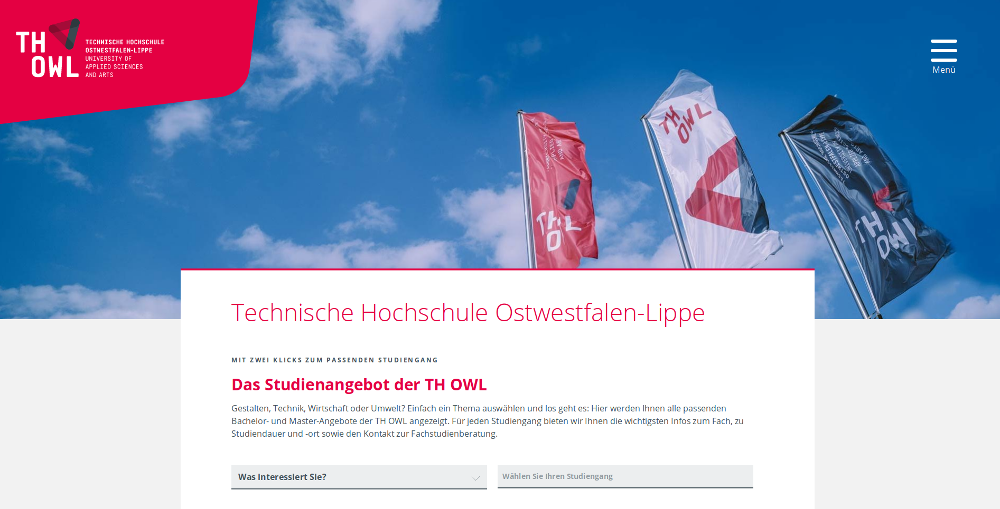
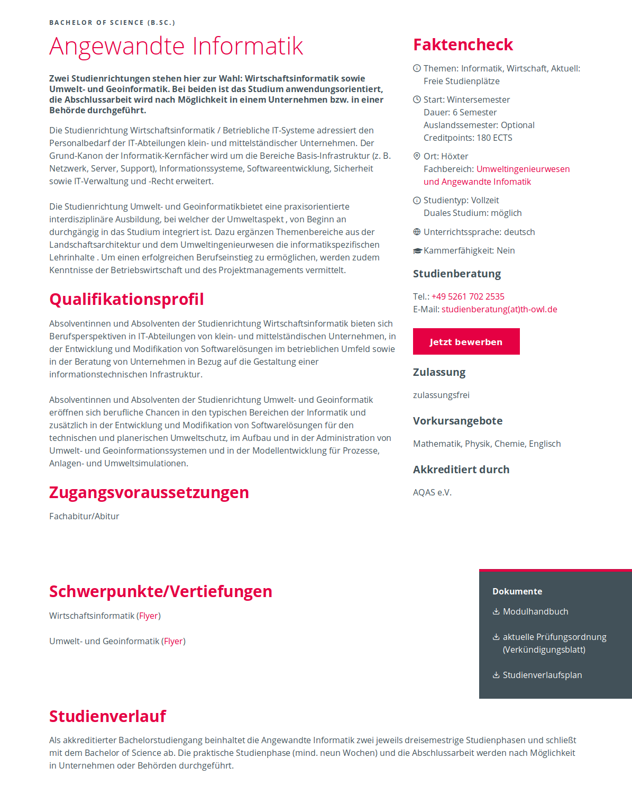

# TYPO3 extension in2studyfinder

## Introduction

in2studyfinder is a free and generic TYPO3 extension, which makes it possible to add, maintain and
display courses of studies in a structured way with different filterable views.
This extension is the basic version, which can be extended by various fields, functions and interfaces and is already
widely used by different universities.

## Installation

Require in2studyfinder via copmoser: `composer require in2code/in2studyfinder` or download a current version
from [https://github.com/in2code-de/in2studyfinder](in2studyfinder on github) or install in2studyfinder from TER or in
the Extension Manager.
Include in2studyfinder's TypoScript Template "Basic Template" and "CSS Template" if you want to have a minimum of styles
in the frontend (e.g. if you don't want to style it yourself).
Create a storage folder in your page tree where you will add your study courses and set all `settingsPids`
and `storagePids` of in2studyfinder to the storage folder's UID.

### Target group

TYPO3 Websites from

* Colleges + Hochschulen
* Universities + Universitäten

### Examples

#### Screenshots

Integration at the home page of TH OWL:



Listview at TH OWL:


Detailview at TH OWL:



Listview at TUM:


Listview at Uni Ulm:


#### Links

* Live examples:
    * https://www.tum.de/studium/studienangebot/
    * https://www.uni-ulm.de/studium/studieren-an-der-uni-ulm/studiengaenge/
    * https://www.th-owl.de/studium/angebote/studiengaenge/
* See full description (german only) under: https://www.in2code.de/produkte/studiengangsfinder/
* Interest in an extension or interface connection? Contact us: <a href="mailto:sandra.pohl@in2code.de">
  sandra.pohl@in2code.de</a>

## Individual modules and functions

in2studyfinder can be extended by individual importers (e.g. from SLCM, Hochschulkompass, HIS, etc.).
It's also possible to extend it with new fields or additional tables or add new functions like a keyword filter.
Please ask Sandra for more information about additional modules or if you need professional services:

https://www.in2code.de/produkte/studiengangsfinder/

sandra.pohl@in2code.de

## Requirements

Version 6.x:

* TYPO3 8.7 or 9.5
* PHP 5.6

Version 7.x

* TYPO3 9.5 or 10.4
* PHP 7.2

Version 8.x - 10.x

* TYPO3 11.5
* PHP 7.4 - 8.0

Version 11.x - 12.x

* TYPO3 12.4
* PHP 8.1 and above

Version 13.x

* TYPO3 13.4 and above
* PHP 8.2 and above

## Events

ModifyDetailActionFluidVariablesEvent: main event for fluid variable manipulation for the detail action
ModifyFastSearchActionFluidVariablesEvent: main event for fluid variable manipulation for the fast search action
ModifyFilterActionFluidVariablesEvent: main event for fluid variable manipulation for the filter action

## Contribution

Contributions are always welcome.

In order to ease the contributions, we provide a ddev setup.

1) install ddev
2) fork and clone project
3) `cd my/project`
4) `ddev start`
5) `ddev initialize`
6) open https://studyfinder.ddev.site/typo3/
7) use `admin` and `password` for backend login

Happy coding

### Build Css and JavaScript

> DDEV:

run command ```ddev build```

> Native:

Requirements: node.js, npm, nvm

* cd Resources/Private && nvm use
* npm install
* npm run build:frontend


### Javascript Events

it is possible to execute your own javascript code on specific events.

**Example:**

```typo3_typoscript
page.includeJSFooter.studyfinderExtenal = EXT:YOUREXTENSION/Resources/Public/JavaScript/extend.js
```

extend.js:
```javascript
if (window.in2studyfinder !== null) {
    let in2studyfinder = window.in2studyfinder;
    let instance = in2studyfinder.getInstance(0);

    instance.pagination.onClick = function() {
        console.log('onPaginationClick');
    }

    instance.filter.onClick = function() {
        console.log('onFilterClick');
    };

    instance.onUpdate = function() {
        console.log('onInstanceUpdate');
    };
}
```

#### API:

**Studyfinder:**

| function    | description                                                    |
|-------------|----------------------------------------------------------------|
| getInstance | returns the requested instance. Parameter instanceId (integer) |

**Instance:**

| event name                                  | description                          |
|---------------------------------------------|--------------------------------------|
| onUpdate                                    | is executed after every fetch call.  |

**Filter:**

| event name                                  | description                               |
|---------------------------------------------|-------------------------------------------|
| onClick                                     | executed after the pagination link click. |

**Quicksearch:**

nothing yet.

**Pagination:**

| event name                                  | description                               |
|---------------------------------------------|-------------------------------------------|
| onClick                                     | executed after the pagination link click. |

### Code quality tools

we use phpmd and phpcs for code quality checks.
The quality checks will be executed automatic before a commit with a pre-commit hook.

Some violations can be fixed automatic with the phpcs fixer (phpcbf).
For automatic fixes execute `ddev ssh` and then `./.build/bin/phpcbf`

#### Execute Tests manually:

PHPCS:

```
ddev ssh
./.build/bin/phpcs
```

PHPMD:

```
ddev ssh
./.build/bin/phpmd Classes/ ansi .phpmd.xml
```

PHPCBF:

```
ddev ssh
./.build/bin/phpcbf
```

Functional:

```
./.build/vendor/bin/phpunit -c /var/www/html/FunctionalTests.xml
```

Unit:

```
./.build/vendor/bin/phpunit -c /var/www/html/UnitTests.xml
```

### Migration

* [Migrations from version 8 to 9](./Documentation/Migration/8to9.md)
* [Migrations from version 9 to 10](./Documentation/Migration/9to10.md)
* [Migrations from version 10 to 11](./Documentation/Migration/10to11.md)
* [Migrations from version 11 to 12](./Documentation/Migration/11to12.md)
* [Migrations from version 12 to 13](./Documentation/Migration/12to13.md)

### External used libraries

    * https://tom-select.js.org/

## FAQ

* Q1: Can I use fe_users or tt_address for the persons?
* A1: Of course, you can map persons to any existing table via TypoScript
* Q2: I need to import persons from an external service, but how?
* A2: Please ask in2code for professional service or individual importers

## Changelog

| Version | Date       | State        | Description                                                                                                                                                                                                                                   |
|---------|------------|--------------|-----------------------------------------------------------------------------------------------------------------------------------------------------------------------------------------------------------------------------------------------|
| 13.0.0  | xxxx-xx-xx | [!!!]FEATURE | Add TYPO3 13 support, various code cleanups: [Commits](https://github.com/in2code-de/in2studyfinder/commits/13.0.0)                                                                                                                           |
| 12.1.0  | 2025-07-07 | FEATURE      | Allow backend sorting of filter items, set correct meta tag property type for keywords. For further information see: [Commits](https://github.com/in2code-de/in2studyfinder/commits/12.1.0)                                                   |
| 12.0.2  | 2025-05-23 | BUGFIX       | Add missing release preparations                                                                                                                                                                                                              |
| 12.0.1  | 2025-05-23 | BUGFIX       | Fix ajax requests in non default language                                                                                                                                                                                                     |
| 12.0.0  | 2025-02-10 | [!!!]TASK    | Update JavaScript event handling, Minor bugfixes, for further information see: [Commits](https://github.com/in2code-de/in2studyfinder/commits/12.0.0)                                                                                         |
| 11.0.0  | 2023-11-24 | [!!!]FEATURE | Add TYPO3 12 support                                                                                                                                                                                                                          |
| 10.0.0  | 2023-07-11 | [!!!]BUGFIX  | prevent javascript exception while paginate if no filter is present in the current template                                                                                                                                                   |
| 9.0.4   | 2023-01-20 | BUGFIX       | Minor bugfixes, for further information see: [Commits](https://github.com/in2code-de/in2studyfinder/commits/9.0.4)                                                                                                                            |
| 9.0.3   | 2023-01-09 | BUGFIX       | Minor bugfixes, for further information see: [Commits](https://github.com/in2code-de/in2studyfinder/commits/9.0.3)                                                                                                                            |
| 9.0.2   | 2023-01-09 | BUGFIX       | Minor bugfixes, for further information see: [Commits](https://github.com/in2code-de/in2studyfinder/commits/9.0.2)                                                                                                                            |
| 9.0.1   | 2022-11-28 | BUGFIX       | Minor bugfixes, for further information see: [Commits](https://github.com/in2code-de/in2studyfinder/commits/9.0.1)                                                                                                                            |
| 9.0.0   | 2022-11-22 | [!!!]FEATURE | Add PHP8 support, add php code quality tools, complete javascript overhaul (no requirement of jQuery anymore) see [Migration from 8 to 9](./Documentation/Migration/8to9.md) for further information                                          |
| 8.0.3   | 2022-10-14 | BUGFIX       | Fix export problem "Cannot unpack array with string keys" by passing values from signal to slot                                                                                                                                               |
| 8.0.2   | 2022-07-18 | BUGFIX       | change makeCategorizable to the new category TCA type "category", fix default course object in the detail view if the course class is overwritten                                                                                             |
| 8.0.1   | 2022-06-03 | BUGFIX       | prevent "must not be accessed before initialization" exception if the caching is disabled                                                                                                                                                     |
| 8.0.0   | 2022-06-02 | [!!!]FEATURE | add TYPO3 11.5 support, drop TYPO3 9 and 10 support (this versions will be supported in the studyfinder 7.x version                                                                                                                           |
| 7.3.0   | 2022-04-22 | FEATURE      | update accessibility, add keyboard navigation for filter                                                                                                                                                                                      |
| 7.2.3   | 2022-04-12 | BUGFIX       | use the correct PageRepository based on TYPO3 Version                                                                                                                                                                                         |
| 7.2.2   | 2021-12-08 | BUGFIX       | various small bugfixes regarding the TCA                                                                                                                                                                                                      |
| 7.2.1   | 2021-11-25 | BUGFIX       | prevent wrong rendered language after multiple ajax filter requests in alternate languages                                                                                                                                                    |
| 7.2.0   | 2021-10-05 | FEATURE      | if a course is edited the frontend cache of this record is cleared                                                                                                                                                                            |
| 7.1.1   | 2021-08-31 | BUGFIX       | various bugfixes                                                                                                                                                                                                                              |
| 7.1.0   | 2020-03-31 | FEATURE      | add single select filters (radio buttons). various bugfixes                                                                                                                                                                                   |
| 7.0.0   | 2020-12-20 | [!!!]FEATURE | add TYPO3 10.4 support, drop TYPO3 8 support, rewrite js to native js (jQuery is currently still needed because of select2)                                                                                                                   |
| 6.2.10  | 2021-01-08 | BUGFIX       | remove the default value '*' for the tca link wizards because this disallowed all file extensions                                                                                                                                             |
| 6.2.9   | 2021-01-07 | BUGFIX       | allow the overwrite of the target action in the select view helper                                                                                                                                                                            |
| 6.2.8   | 2020-05-13 | BUGFIX       | fix serialization exception by filter initialization for TYPO3 9.5.17 and above if the caching is enabled                                                                                                                                     |
| 6.2.7   | 2020-01-14 | BUGFIX       | fix "Undeclared arguments.." at TYPO3 9.5.x in the studyfinder backend module                                                                                                                                                                 |
| 6.2.6   | 2019-12-13 | BUGFIX       | remove debug from studycourse controller                                                                                                                                                                                                      |
| 6.2.5   | 2019-10-16 | BUGFIX       | correct wrong prioritization of selected filter restrictions                                                                                                                                                                                  |
| 6.2.4   | 2019-10-04 | TASK         | use cache for fast search view to increase the performance                                                                                                                                                                                    |
| 6.2.3   | 2019-09-24 | BUGFIX       | set no default l10n_display for single select TCA at the TcaUtility. This prevents save issues for required select fields on translated records at TYPO3 7 and 8 (https://forge.typo3.org/issues/77257, https://forge.typo3.org/issues/88452) |
| 6.2.2   | 2019-09-06 | TASK         | make content object data available in the fast search                                                                                                                                                                                         |
| 6.2.1   | 2019-08-27 | BUGFIX       | set settings PID for FacultyRepository, fix typo                                                                                                                                                                                              |
| 6.2.0   | 2019-08-27 | FEATURE      | add new view fast search which shows only an input (select) with the available courses                                                                                                                                                        |
| 6.1.0   | 2019-06-03 | FEATURE      | remove unnecessary url attributes of the quick select, add the "manipulatePropertyBeforeExport" signal                                                                                                                                        |
| 6.0.2   | 2019-04-02 | BUGFIX       | add missing query execution, fix html escape from content element renderer, move ext_icon into Public/Icons/                                                                                                                                  |
| 6.0.1   | 2019-03-18 | BUGFIX       | fix possible detail view exception because the lib.activeDateFormat do not exist                                                                                                                                                              |
| 6.0.0   | 2019-03-13 | [!!!]TASK    | add TYPO3 9.5 support                                                                                                                                                                                                                         |
| 5.0.0   | 2019-03-01 | FEATURE      | adds an backend module with course export. Last release for TYPO3 7.6                                                                                                                                                                         |
| 4.0.2   | 2018-11-26 | BUGFIX       | fix 404 redirect on any course detail page. Last release for TYPO3 6.2                                                                                                                                                                        |
| 4.0.1   | 2018-10-16 | TASK         | update npm modules and gulp to prevent JavaScript vulnerabilities of outdated node modules                                                                                                                                                    |
| 4.0.0   | 2018-08-23 | [!!!]TASK    | use interfaces for the domain objects wherever possible                                                                                                                                                                                       |
| 3.0.8   | 2018-06-06 | BUGFIX       | reduce the page type num to prevent exceeded integer number in 32 bit systems                                                                                                                                                                 |
| 3.0.7   | 2017-12-07 | BUGFIX       | fix filter behavior if a filter is disabled via typoscript and also set in the backend, add the typoscript option disabledInFrontend for filters                                                                                              |
| 3.0.6   | 2017-11-27 | BUGFIX       | fix wrong ajax URL handling, fix duplicate cache entry if no contentElementStoragePid is set                                                                                                                                                  |
| 3.0.5   | 2017-11-27 | BUGFIX       | fix wrong ajax URL if realUrl or a similar extension is used                                                                                                                                                                                  |
| 3.0.4   | 2017-11-23 | BUGFIX       | set the correct storage pids for ajax requests if an "Record Storage Page" is selected                                                                                                                                                        |
| 3.0.3   | 2017-10-19 | BUGFIX       | fix broken translations on filter ajax requests. Add a default configuration language configuration 0 = de and 1 = en                                                                                                                         |
| 3.0.2   | 2017-10-19 | BUGFIX       | Fix leading slashes for typo3 8 if in2studyfinder_extend is used                                                                                                                                                                              |
| 3.0.1   | 2017-09-22 | BUGFIX       | Fix no filter parameter in the URL, remove use statements in TCA to prevent use conflicts, fix broken filter accordion icons, add button highlighting                                                                                         |
| 3.0.0   | 2017-09-19 | [!!!]TASK    | [!!!] update HTML markup, compatibility for Typo3 8.7 add basic CSS styling, change CSS classes, update javascript handling. For more details look at the release commit 3.0.0                                                                |
| 2.1.2   | 2017-08-30 | BUGFIX       | Use the correct repository if the extension is extended                                                                                                                                                                                       |
| 2.1.1   | 2017-08-29 | BUGFIX       | Use correct cmpObj function if the course model has been overwritten                                                                                                                                                                          |
| 2.1.0   | 2017-08-24 | [!!!]FEATURE | [!!!] Drop StuyCourseListContextRepository, add option to save selected filter values, For more details look at the release commit 2.1.0                                                                                                      |
| 2.0.4   | 2017-06-28 | BUGFIX       | Always set filter, hide invalid start of study date, use cache API correctly                                                                                                                                                                  |
| 2.0.3   | 2017-06-13 | BUGFIX       | Some small CSS fixes                                                                                                                                                                                                                          |
| 2.0.2   | 2017-06-12 | BUGFIX       | Fix number of requests on quickjump, change loading image with SVG                                                                                                                                                                            |
| 2.0.1   | 2017-06-02 | BUGFIX       | Add a readme and license file                                                                                                                                                                                                                 |
| 2.0.0   | 2017-05-31 | Task         | Initial free release on Github                                                                                                                                                                                                                |
